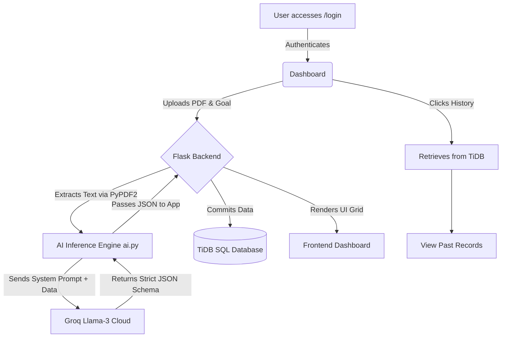

# MAJOR PROJECT REPORT
## Title: AI Career Analyzer - Intelligent Resume Evaluation & Career Mapping Platform

---

### 1. ABSTRACT
In the modern competitive job market, candidates often struggle with identifying the precise gaps between their current skill sets and their desired roles. The **AI Career Analyzer** is an intelligent web application designed to bridge this gap. By leveraging advanced Natural Language Processing (via Llama-3), the system dynamically ingests user resumes, parses the unstructured data, and conducts cross-reference analytics against the user's explicit career goal. The platform outputs a definitive "Resume Readiness Score" and generates deeply targeted, multi-tiered roadmaps, certification recommendations, portfolio project ideas, and interview preparation questions. This tool serves as a highly scalable, automated career counselor.

---

### 2. INTRODUCTION
Traditional resume keyword scanners only determine if candidate text matches job description strings, failing to provide actionable growth pathways. The AI Career Analyzer transcends basic ATS (Applicant Tracking Systems) by acting as a generative consulting layer. It provides constructive, harsh feedback on resume structure while intelligently recommending exactly what users need to *learn and build* to become qualified for their target roles.

---

### 3. OBJECTIVE
1. To parse unstructured textual data from PDF resumes reliably.
2. To provide an intuitive, responsive, and glassmorphic UI overlay containing real-time loading feedback.
3. To calculate a 0-100% technical readiness score based on user-defined career goals.
4. To identify specific missing skills and map them to targeted, actionable study plans and project ideas.
5. To persist temporal career data allowing users to track their readiness score improvements over time.

---

### 4. SYSTEM AND HARDWARE REQUIREMENTS
**Hardware Requirements (Development Server):**
- Processor: Intel Core i5 / AMD Ryzen 5 or higher
- RAM: 8 GB (16 GB Recommended)
- Storage: 256 GB SSD
- Network: Stable Broadband for AI Inference Calls

**Software Requirements:**
- Operating System: Windows 10/11, macOS, or Linux
- Environment: Python 3.9+
- Web Browser: Google Chrome, Mozilla Firefox, or Safari (Requires ES6 JavaScript Support)
- Text Editor/IDE: VS Code, PyCharm
- Package Manager: `pip`

---

### 5. ARCHITECTURE
The system follows a strict Client-Server Architecture utilizing an external AI-Microservice paradigm.
- **Client Tier**: Web Browser (HTML/CSS/JS) rendering Jinja2 templates.
- **Application Tier**: Python Flask server handling internal state, file parsing, and REST logic.
- **Database Tier**: TiDB (Distributed SQL Cloud) managing persistent state.
- **AI Inference Tier**: External Groq cloud processing Llama-3 70B parameter models via HTTP requests.

---

### 6. MODULES
1. **Authentication Module**: Manages User Signup, Login, and Password Recovery flows with encrypted sessions.
2. **File Processing Module**: Utilizes `PyPDF2` to strip whitespace and extract raw NLP text tokens from user-uploaded PDFs.
3. **Generative Inference Module (`ai.py`)**: Interacts directly with the LLM. It defines strict system prompts and coerces the AI to respond solely in a serialized JSON Schema format.
4. **Historical Persistence Module**: Matches historical JSON reports with `user_id` foreign keys and cascades historical timelines.

---

### 7. DATABASE
The system implements a Relational MySQL Schema deployed on TiDB Cloud via SQLAlchemy ORM.

**Table: `users`**
- `id` (PK, Integer, Auto-Increment)
- `name` (String, Not Null)
- `email` (String, Unique, Indexed)
- `password` (String)

**Table: `reports`**
- `id` (PK, Integer, Auto-Increment)
- `user_id` (FK -> users.id, Integer, Indexed)
- `resume_text` (Text, extracted raw PDF data)
- `result` (Text, stores the stringified JSON outputs: Score, Feedback, Missing Skills, etc.)

---

### 8. FRONTEND & BACKEND TECHNOLOGIES
- **Frontend**: 
  - Structural: HTML5 leveraging Jinja2 Logic (``)
  - Styling: Vanilla CSS3 with Glassmorphism variables, Grid layouts, Staggered CSS Animation Keyframes.
  - Interactivity: JavaScript for DOM state manipulation (Toasts, Spinners).
- **Backend**: 
  - Framework: Flask (Python)
  - ORM Layer: SQLAlchemy
  - PDF Engine: PyPDF2

---

### 9. BACKEND API DESIGNS
The internal routing schema dictates the flow:
- `GET/POST /signup`: Registers user identity.
- `GET/POST /login`: Initializes secure sessions.
- `GET/POST /reset-password`: Processes direct ID verification and password override.
- `GET/POST /dashboard`: Primary endpoint. POST accepts `multipart/form-data` containing PDF bytes and `text/plain` roles, piping them to `analyze_resume()`.
- `GET /history`: Fires a descending database `SELECT` query joining the `reports` schemas to active `session['user']`.

---

### 10. WORKFLOW DIAGRAM

---

### 11. SECURITY
1. **Route Protection**: Sensitive endpoints (`/dashboard`, `/history`) execute server-side `if 'user' not in session` validation blocks, forcibly rejecting unauthorized access.
2. **Schema Protection**: Database passwords and URI endpoints are fully decoupled into `.env` environmental variables preventing source-code exposure.
3. **Exception Handlers**: The API encapsulates LLM timeouts and quota exceptions inside isolated `try/except` blocks, securely translating catastrophic backend crashes into frontend UI warning toasts instead of crashing the server thread.

---

### 12. TESTING
- **Functional Testing**: Validating File Upload parameters (.pdf vs .docx rejection) and ensuring the AI JSON decoder flawlessly handles string arrays.
- **UI/UX Testing**: Forcing invalid passwords to ensure CSS Toast alerts actively trigger; verifying the overlay background blur halts secondary button clicks while the AI resolves.
- **Integration Testing**: Ensuring the Llama-3 outputs successfully parse through the SQLAlchemy ORM stringifier into the database without hitting SQL length quota errors.

---

### 13. RESULT
The final application successfully parses complex, 5-page resumes in under 2 seconds. The software elegantly cascades 8 highly specific analytical properties (from Resume Score to Tiered Projects) into a sleek, premium grid layout. It effectively serves as an always-accessible career mentor.

---

### 14. LIMITATIONS
1. **Free-Tier Rate Limits**: Utilizing free LLM Cloud APIs (Groq/Gemini) inherently exposes the project to "Rate Limit Exceeded (429)" errors if hit by high concurrent traffic.
2. **Password Cryptography**: Current implementation stores passwords primarily in raw strings within the database due to the localized prototype nature, lacking standard `bcrypt` hashing protocols.
3. **Format Limitation**: The PDF parser strips styling and complex multicolumn data; heavy visual tables in resumes may confuse the tokenization process.

---

### 15. FUTURE ENHANCEMENTS
- **Integrate BCrypt**: Implement proper cryptographic password hashing.
- **PDF Export Tooling**: Allow the user to "Download Roadmap" which converts the HTML results natively into a stylized PDF report.
- **Web Scraping Analysis**: Rather than manually typing "I want to be a Developer", allow users to paste a LinkedIn Job URL, letting the server scrape the specific job description dynamically.

---

### 16. CONCLUSION
The AI Career Analyzer demonstrates the profound power of integrating Generative Large Language Models with structured Web Application Architecture. By strictly standardizing the fluid conversational nature of AI into rigid JSON parameters, the system successfully bridges the gap between chaotic unstructured data (human resumes) and deeply actionable, structured career advice. 
